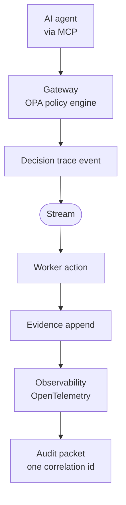

# Agent Audit Packet

Most teams say their AI systems are auditable. Very few can hand you a folder
that proves it.

This is that folder: the evidence bundle a governed agent system should be able
to produce for **one single correlated decision**. Everything inside hangs off
one correlation ID, the way it would in production. It is a worked example,
not a product. The point is the diff between this and what your system can
produce today.

```text
packet/corr-500bdcb7dacac332/
├── decision_traces.jsonl        what the gateway decided, and under which policy
├── evidence.jsonl               what the worker then did, bound to that decision
├── policy/
│   ├── decision.rego            the policy the decision was evaluated against
│   └── metadata.json            bundle version and hash
├── schemas/
│   ├── decision_trace.avsc      versioned contract for the trace
│   ├── evidence.avsc            versioned contract for evidence
│   └── SHA256SUMS               integrity hashes for both
├── observability/
│   └── pointers.json            correlation, trace, and span ids into the tracing backend
└── supplychain/
    ├── cosign.pub               key the gateway and worker images were signed with
    └── sbom_out/                SPDX bills of materials for both services
```

## Read it in this order

1. **`decision_traces.jsonl`** is the spine. One line per governed decision. The
   sample records an agent (`mcp-client`, role `developer`) requesting `deploy`
   of `backend` to `dev` with `tests_passed = "true"`. The policy engine
   returned `allow` with the rationale `ALLOW_DEPLOY_DEV`, and the trace names
   the exact policy bundle by hash.
2. **`policy/decision.rego`** is the rule that produced that answer. Default
   deny. Dev deploys need passing tests; prod deploys need an explicit human
   approval. `metadata.json` carries the bundle hash the trace cites, so you
   can check that the policy shipped here is the policy that decided.
3. **`evidence.jsonl`** closes the loop. The worker records that the allowed
   action executed, with the same correlation and trace ids, the same action,
   and the decision it was acting under. A decision with no evidence is an
   action that may never have happened; evidence with no decision is an action
   nobody authorized.
4. **`schemas/`** are the contracts for the two record types. Versioned,
   hash-summed, and deliberately minimal. Steal them.
5. **`observability/pointers.json`** is how an operator drops from the packet
   into the tracing backend for the same run. The sample points at a local
   Jaeger; yours would point at wherever your traces live.
6. **`supplychain/`** answers the last question an auditor asks: how do you
   know the binaries that produced this evidence were the binaries you think?
   The public signing key and the SBOMs for both services are the answer.

## Verify it

```bash
./verify.sh
```

The script checks that the schema files match their recorded hashes, that both
record files parse, that every trace cites the policy bundle shipped in the
packet, that every evidence record closes the loop on an allowed decision with
matching ids and action, that no allowed decision is missing its evidence, and
that the observability pointer matches the trace. CI runs the same script on
every push.

Point it at your own packet once you have one:

```bash
./verify.sh path/to/corr-<id>
```

## How the packet is produced



An agent requests an action through the Model Context Protocol, passing its
execution attributes. The gateway evaluates the request against the policy
bundle and emits a decision trace naming the bundle by hash. The decision
travels over a stream to the worker, which performs the action and appends an
evidence record bound to the same correlation id. Traces and evidence carry
W3C trace context, so the run is visible end to end in the tracing backend.
An export step gathers the trace, the evidence, the policy bundle, the schemas,
the observability pointers, and the supply-chain attestations for one
correlation id into the packet you are looking at.

The architecture this comes from is described at
[artemisowl.io/artifacts/decisionops-control-plane](https://artemisowl.io/artifacts/decisionops-control-plane/).
The argument for why trust is policy plus evidence at every boundary is
[artemisowl.io/research/trust-as-policy-and-evidence-across-boundaries](https://artemisowl.io/research/trust-as-policy-and-evidence-across-boundaries/).

## Use it

Diff it against your own system. For each file, ask one question: could we
produce this today, for any decision, on demand? Every no is a line in your
governance backlog.

Ungated and free to reuse internally. Apache-2.0.
